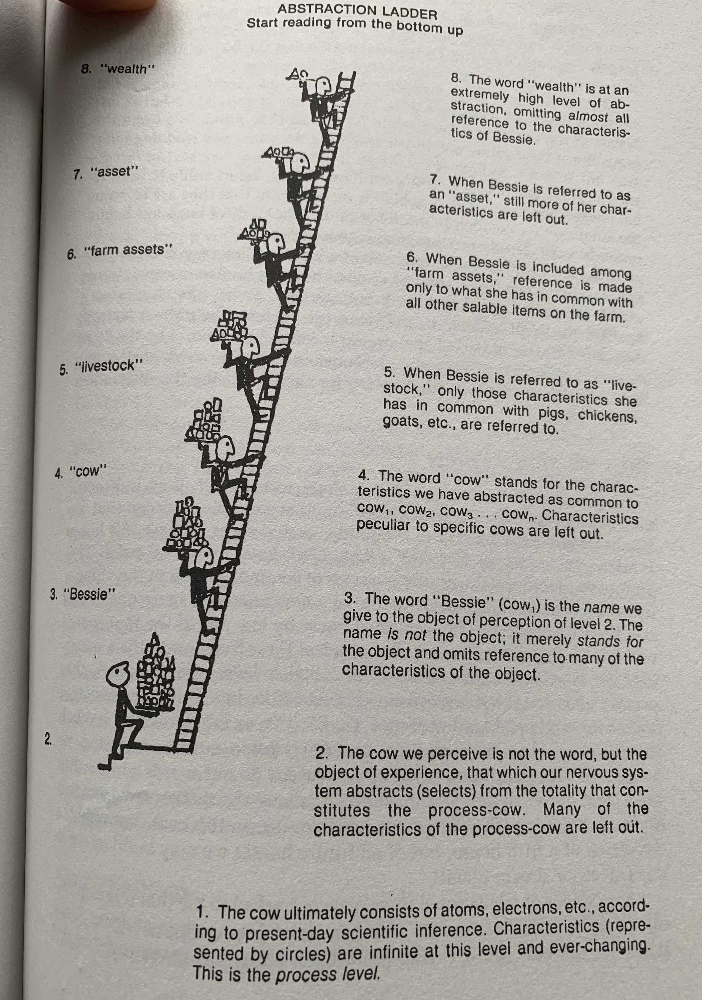

# Names Pin the Jell-O to the Wall

Your code and its artifacts are strewn with names. You name repositories, files,
packages, classes, functions, variables, and on and on. The names you choose
determine the quality of the conversations you have with your programmer peers.

On the flip side of that bargain, your understanding of libraries and
frameworks, i.e. other people's code, starts with names. Names form the
substrate of APIs, delineating their boundaries, clarifying their inputs and
outputs, and defining how they're used.

If you can trust that a library works, you need look no further than its API
docs to understand it. Ideally, API docs are the only point of contact you have
with a library. And they are, essentially, a bunch of names.

Just as a writer grinds through word choices, a programmer must struggle with
names. As the joke goes, the two hardest things in computer science are naming,
cache invalidation, and off-by-one errors. No matter the programming language,
no matter whether you're operating from a functional or object-oriented
perspective, no matter if the language is statically or dynamically typed, names
are a ubiquitous and critical part of your code. Cache invalidation may not
matter in your application, but names sure do. The quality of your work depends
on the quality of your names.

When writing code, you spend a lot of time burrowed in the minutiae of specifics. You
ply your craft at the mercy of unbending syntax rules &mdash; rules that will bring a
million-line codebase to its knees over a single missing character. You write
small functions that, given an exact input, produce an exact output. Every time.

But naming demands that you wrest your mind from granular, concrete details and
think more generally, more categorically.

## The Abstraction Ladder

The linguist Sam Hayakawa, in his book [Language in Thought and
Action](https://www.amazon.com/Language-Thought-Action-S-I-Hayakawa/dp/0156482401/),
describes a model of language he calls the Abstraction Ladder. On this
conceptual ladder, the bottommost rung holds a concrete idea. The topmost rung
is occupied by a decidedly abstract, intangible concept. In between, ideas get
more abstract the higher up they are. The Abstraction Ladder is straightforward
to understand, but studying it leads to broad and profound insights.

**This is a temporary, placeholder image**



**TODO: Replace above with custom illustration/diagram**

[Might take the concreteness caveat out of the diagram and only mention it in th
text.]

Consider the diagram above. [Assuming it's a dog at the bottom] Before the
ladder even starts, it acknowledges that Molly is far from static, she's
actually a being in-process, constantly changing, and composed of numerous
subsystems. But from a cognitive, linguistic perspective, Molly seems like a
concrete entity. Indeed, associating a name with a living being is often the
first utterance of a toddler learning to speak - "Mama."

The next rung up the ladder, "Dog" seems like a small step. But, consider the
enormous mental processing it takes for a toddler to learn to ignore the
differences between the family dog Molly, a [small breed - Corgi?], and the
great dane that lives down the street, then to communicate this understanding by
categorizing them with the word "dog." Coming by this ability to abstract takes
enormous mental development, but once it's learned, it's automatic, you come by
it without perceived thought.

The linguist is concerned with the relationship between words and abstractions
and meaning. So too is the programmer. Your words take the form of names. Your
names communicate meaning. Yes, you write comments as well, but comments often
stand in to explain names that aren't quite right. A well-chosen name can
obviate the need for an explanatory comment.

## Naming functions

Communication is most effective when it spans various levels of abstraction,
when it travels up and down the ladder. Just stating that you should consider
abstract ideas when naming things in your code is not enough. Providing abstract
naming advice also requires concrete examples in order to be convincing.
Concrete examples explain abstract ideas. In order to explain the color green,
you might use examples like leaves in summertime, the bottom light of a traffic
signal, or the color of an emerald.

Consider a requirement in your application to display a person's first and last
name. Simple enough. But the name you retrieve from an an external data source
that you do not own sometimes contains extra whitespace &mdash; leading,
trailing, and in between. For example, the name might arrive in your application
as " Jane  Doe   ". The unpredictable, extra spaces cause issues in your UI and you
need to strip the whitespace out for presentation.

[Remove or abbreviate this paragraph, removing the stuff about trim, or
acknowledging that a simple trim will not work due to extra whitespace between
parts of the name.]

Since you do not own the data source, you cannot fix the problem at its root.
You check the language documentation's standard string library and the name
`trim` catches your eye. You try that function but it's not quite right. Given
the example string above, it trims leading and trailing whitespace as you'd
like, but the extra space between the first and last names persists: `Jane Doe`.
What you need is a way to get just the words in the name and join them with a
space. Further docs investigation reveals both `String.split` and `Enum.join`.
Used together, they do exactly what you need.

```elixir
# In syntax that should be familiar to most programmers
name = "   Jane  Doe "
list = String.split(name)
Enum.join(list, " ")
```

Sidenote: these simple examples could be written similarly using the standard
library of almost any modern language. Since they are being shown in Elixir,
henceforth, they will use idiomatic Elixir syntax. Elixir's pipe operator `|>`
passes the result of one operation as the first argument to the next. It affords
graceful and easy-to-read function composition:

```elixir
# Returns "Jane Doe"
"   Jane  Doe "
|> String.split()
|> Enum.join(" ")
```

### Mirrors ???

You have figured out an implementation that works. You have written tests (which
are not shown in this article's examples). In your application, there's a
`PersonPresenter` module, in which it belongs. But, now you must create a
function and name it.

```elixir
defmodule PersonPresenter do
  # literal function name
  def split_and_join(name)
    name
    |> String.split()
    |> Enum.join(" ")
  end
end
```

[REWRITE THIS PART FOR NEW RULE #1]

At this point, many programmers reach for a literal explanation in choosing a
function name, like `split_and_join` above. Indeed, the code splits and joins a
name. The name of the function explains how the code works now. It's quick and
easy to conceive of; it's convenient.

But recall that the data comes from a source that you don't own. It's likely to
change in unpredictable ways. Even code and data that you *do* own are
susceptible to ever-changing business requirements. The code you write today
might seem concrete, but like Molly the dog, even seemingly concrete entities
are not static. Code is a being in-process, constantly churning. Your source
control repository's diff log is a more accurate mental model of your
application than current files on disk.

It's quite possible that the name data will someday arrive in a different form
and that split and join will no longer be the exact operations required to
format it for presentation. Naming a function after its current implementation
leaves you no wiggle room for change. `split_and_join` explains what the
function does, but not what it means. In terms of the Abstraction Ladder, this
name would be on a lower rung, if not the lowest.

[New subsection?]

[Consider new requirement is to add a salutation. Then, in later example, write
that a hypothetical change to last, first order would only require internal
implementation changes. Near discusssion of `format_address`.]

Consider a new requirement. As it turns out, the data has not changed, but the
product team would like names to be displayed in last name, first name order.
The implementation will be simple enough to rework. But the name
`split_and_join` has painted you into a corner.

Should you rename the function, perhaps to `split_and_join_and_reorder`? Down
that path lies madness. The naming decision that seemed convenient has proven to
be expensive.

This simple example obscures an even more costly consideration. Your codebase
depends on many messaging interfaces, as it should. In order to get anything
done, your code must send messages somewhere. In other words, it must know names
of functions it can call. When your code calls a function, it becomes dependent
upon the name of that function. Again, this is fine. It's better than fine;
message interfaces provide the loosest form of coupling. Well-designed code
depends on the messages it sends to direct collaborators and little else. Over
time, many parts of your codebase may become dependent on a single message name.

In your hypothetical app, a person's name is presented in several views.
`split_and_join` is called from many places. Many parts of your codebase have
become dependent upon that name. Alarm bells should be going off in your head
when you see names representing implementation details spread throughout your
codebase. Changing this function name at its source means changing it everywhere
it's called. There's a code smell called Shotgun Surgery that occurs when making a
single modification requires that you make changes in many other places. In the
categories of code smells, Shotgun Surgery is considered a Change Preventer.

Indeed, the bar for changing `split_and_join` has increased dramatically over
time as more and more code has come to depend on that function name. Public
APIs are versioned for this very reason: dealing with API changes is an
expensive process, fraught with peril. Handling the requirements change has
become difficult and expensive due to a hastily chosen name.

You have a couple of options.

You can change the name and all its dependents throughout your codebase. This
works if your tests are robust and there are no message sends that aren't
revealed by grepping or tooling.[^3][^4]

You might decide to live with the lie, implementing the new functionality
without changing the function name. Your name then professes that the function
behaves in way that it actually doesn't. This decision is the quickest to
implement. It might appease your product team, but in terms of software
engineering, it's kicking the can down the road. At best, you're accruing
technical debt and confusing your peers.

The cost of code is in the reading. Your code will be expensive to read as long
as it is poorly named. But living with the lie and conceding technical debt, in
this case, is the optimist's view. Changing a functions's behavior to betray its
name almost inevitably leads to downstream bugs. It's not hard to imagine a
future programmer, maybe even you, deciding to trust a name and being burned
with bugs when the result of the function defies expectations. Once this trust
is broken in your codebase, programmers in your organization will feel compelled
to dig into the implementation guts of functions all the time to determine what
they actually do. Working on untrustworthy code is unpleasant and
time-consuming. Time is money. Poorly named code is expensive.

You might determine that the cost of changing implementing the new requirement
is too high in the present and poses too much risk in the near future. You'd
prefer to prevent the change altogether. You push back on the product team,
explaining that it's too complex and expensive to make now. Expect looks of
befuddlement in response. Those looks are justified. A simple request should be
simple to implement. The more you can harmonize the seemingly simple and the
actually simple, the more you engender organizational trust in software
engineering.

This might all seem like hyperbole. How can a single poorly named function make
your programming life unpleasant and engender organizational mistrust in
software engineering? A single poorly named function probably won't be a big issue. But, the habit of
naming functions after their current implementation will infect 
your codebase, making all aspects of
development slower, more expensive, and less fun.

Function names should tell the right story and stand the test of time through
changes in implementation. Naming is difficult, but names matter. It's incumbent
upon you to develop this core programming skill. So, how should you name
functions?

### Step Higher

`split_and_join` is clearly named after its current implementation. The
requirement to reorder to `last, first` has forced you into a decision: to
rename or not to rename. But, that decision could have been avoided altogether,
by adhering to a simple guideline in naming functions:

**Name functions one level of abstraction higher than their implementation.**

On the Abstraction Ladder, `split_and_join` occupies a lower rung. It's literal
and concrete. In order to name the function one rung higher, you
must consider the function from the perspective of its callers. What service is
the function providing to its callers?

One way to derive names is to consider other things in the same category of the
current implementation and then to name that category. What other things might
you do to a name to present it? A simple matrix helps:

| Person name                  | ???                 |
|------------------------------|---------------------|
| Remove extraneous whitespace | `remove_whitespace` |
| Present last name first      | `last_first`        |
| Capitalize words             | `capitalize`        |
| Prepend salutation           | `add_salutation`    |

### Context matters

The verb "present" might be a candidate for as a column heading in the matrix
above. But the name of the module is `PersonPresenter`. Using the word `present` would read like an echo chamber:
`PersonPresenter.present_name`. But there's another issue with the name
`present`. From the internal perspective of the `PersonPresenter`
module, everything is about presentation. But naming a public function demands
that you consider its purpose from an outside perspective. Function callers want
the presenter to do something specific to a person's name. They want it to be
formatted. Context matters. `format_name` is a better choice.

- [ ] Insert updated code sample

[Below: add prose about context of `PersonFormatter.name`]

Context and perspective also dictate that the function be named not just
`format`, but `format_name` Why include `_name` when the function will accept
`name` as a parameter? Despite the fact that it, too, creates a bit of an echo
chamber, it contains the right amount of information from the caller's
perspective. Right away you know what this does: `PersonPresenter.format_name("
Jane Doe ")`. You are not forced to open up a file and understand implementation
details. `format_name` also leaves open the possibility of something like `format_address`.

`format_name` is higher on the Abstraction Ladder than
`remove_whitespace`, which is a rung higher than `split_and_join`.

- [ ] Insert a diagram showing the above

Should you need to change how the name is formatted, in response to upstream
data changes or new application requirements, the impact of the implementation
will be constrained to the internals of the function. The name will continue
to be appropriate and no dependents will be forced to change.

## Climb up and down the ladder

Does software design really demand this level of attention to detail, this
careful weighing between naming options for something as unremarkable and
ordinary as a function name? If you want to do your best work, yes, it does.
Names matter. Attention to details matter. Writing software is about more than
just getting something to work. At an abstract level, it's an expression of thought and
communication, like writing, like speaking, like relationship-building. Your
thoughtfulness around names will be rewarded.

[Add prose: it's not uncommon to rename functions. Often it's avoidable, but not
always.]

Literal function names indicate that you know what the function does but may not
have considered what it means. When your internal dialog spans multiple levels
of the Abstraction Ladder, you become open to the full breadth of understanding
that categorical thinking bestows. That deeper understanding leads to better
code in every way.

## PLACEHOLDER Next ???

You have a guideline for improving names in your code: name functions at one
level of abstraction higher than their implementation. Your code will be better
for following this guideline, but how do you help others improve? How do you
spread value throughout your organization? Part 2 of this article will explore
those questions and offer advice about naming classes and modules.

[Mention: the ideas and techniques in this article rely and expand upon the
information in 99B. 2nd edition.]

- [ ] Need to decide on method/function and message send nomenclature. Keep it
      consistent, or depend on the footnote and vary throughout? If vary
      throughout, it's not to confuse
      the point, but to reinforce the fact that naming concerns span across
      programming subgenres.

Footnotes:

[^1] The one about Elixir pipe syntax?

[^2] Message sends and function calls. In object-oriented parlance, you send
messages. In functional parlance, you call functions. This article is concerned
with naming, which applies to all of high-level programming. As such, it treats
these ideas equally and refers to them interchangably.

[^3] Metaprogramming gets a bad rap because it complicates this kind of change.
Failures attributed to metaprogramming are often failures of naming, at their
root.

[^4] Compiled languages may save your bacon for this kind of change. But, the
original sin still stands. At some point, overly concrete thinking and hasty
decision making will defeat the security blanket of your tools.
